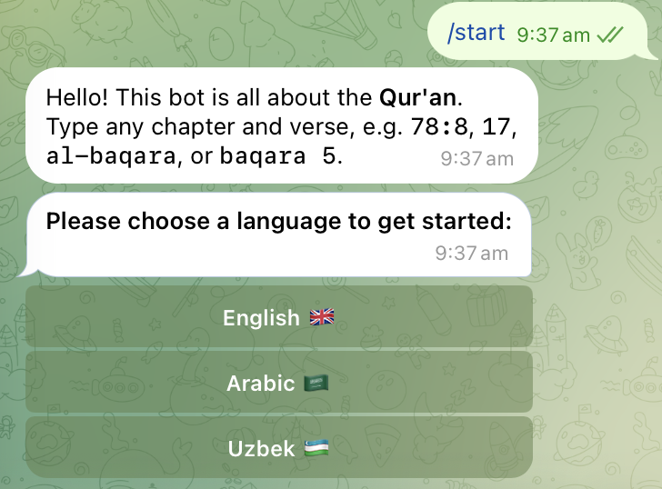
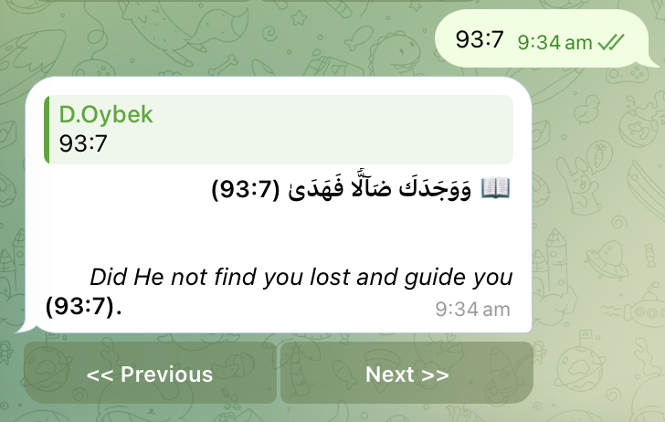
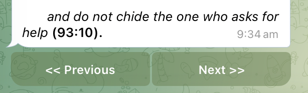
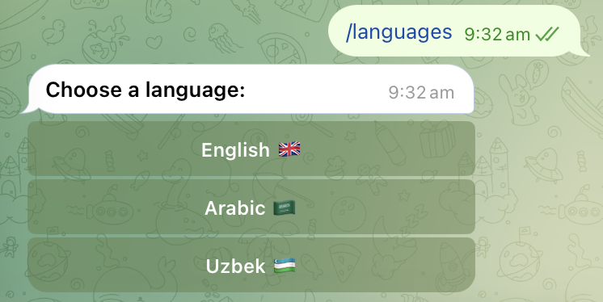
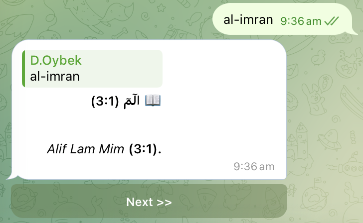

# Qur'an Telegram Bot

An asynchronous Telegram bot that serves Qur'an verses and whole surahs with the
Arabic text alongside a translation in **English**, **Arabic**, or **Uzbek**.

Users can look a passage up by number (`2:255`, `17`), by surah name
(`al-baqara`, `ixlos`), or by name + ayah (`baqara 5`, `nas 3-oyat`), then page
through the surah with inline **« Previous / Next »** buttons.

---

## Features

- **Flexible queries** – chapter (`17`), chapter:verse (`2:255`), surah name
  (`al-fatiha`), or name + ayah (`baqara 5`, `an-nas 3-oyat`). English and Uzbek
  surah names are both recognised.
- **Three translations** – English (`eng-abdelhaleem`), Arabic
  (`ara-quran-la1`), Uzbek (`uzb-muhammadsodikmu`); Arabic script is always shown
  with the translation.
- **Stateless in-place navigation** – the whole surah is downloaded once, held in
  a bounded TTL cache per user, and Prev/Next just edits the message in place – no
  extra API or DB calls.
- **Per-user language** persisted in SQLite (`aiosqlite`), remembered between
  sessions; old databases are auto-migrated with `ALTER TABLE`.
- **Upstream response cache** – surah payloads cached in-process for a day
  (`cachetools.TTLCache`), so repeat lookups and navigation are free.
- **Abuse control** – per-user throttling middleware drops updates that arrive
  faster than `THROTTLE_SECONDS`.
- **Optional admin forwarding** – when configured, every inbound user message is
  relayed to an admin chat through a second bot token.
- **Webhook-first** – runs behind an `aiohttp` webhook server in production with a
  secret-token check, or long polling for local development.
- Typed config with `pydantic-settings`; `ruff` + `pytest` for quality.

---

## Screenshots


| `/start` + language picker | Verse lookup (`2:255`) | Surah navigation |
| --- | --- | --- |
|  |  |  |

| Language selected | Lookup by name (`al-fatiha`) |
| --- | --- |
|  |  |

---

## Bot commands

| Command | Description |
| --- | --- |
| `/start` | Restart and choose a language |
| `/languages` | Change translation language |
| `/help` | Contact / help |

Any other text message is treated as a verse/surah query.

---

## Requirements

- **Python 3.11+**
- A Telegram bot token from [@BotFather](https://t.me/BotFather)
- Outbound HTTPS access to `cdn.jsdelivr.net` (the Qur'an data source)
- For webhook mode: a public HTTPS URL that forwards to the bot's port

### Runtime dependencies

| Package | Version | Purpose |
| --- | --- | --- |
| [`aiogram`](https://pypi.org/project/aiogram/) | `>=3.15,<4` | Telegram Bot API framework (routers, webhook server, middlewares) |
| [`aiohttp`](https://pypi.org/project/aiohttp/) | `>=3.10` | Async HTTP – Qur'an API client, admin forwarder, webhook server |
| [`aiosqlite`](https://pypi.org/project/aiosqlite/) | `>=0.20` | Async SQLite driver for per-user language storage |
| [`pydantic-settings`](https://pypi.org/project/pydantic-settings/) | `>=2.6` | Typed configuration loaded from `.env` / environment |
| [`cachetools`](https://pypi.org/project/cachetools/) | `>=5.5` | In-process TTL caches (API responses, open surahs, throttling) |

### Dev dependencies

| Package | Version | Purpose |
| --- | --- | --- |
| [`ruff`](https://pypi.org/project/ruff/) | `>=0.6` | Linter / formatter |
| [`pytest`](https://pypi.org/project/pytest/) | `>=8` | Test runner |
| [`pytest-asyncio`](https://pypi.org/project/pytest-asyncio/) | `>=0.24` | Async test support (`asyncio_mode = auto`) |

---

## Setup

```bash
# 1. Clone
git clone <repo-url>
cd telegram_bot_quran

# 2. Virtual environment
python -m venv .venv
source .venv/bin/activate        # Windows: .venv\Scripts\activate

# 3. Dependencies
pip install -r requirements.txt
#   …or, to also get the dev tools:
pip install -e ".[dev]"

# 4. Configuration
cp .env.example .env
#   then edit .env (see below)
```

### Configuration (`.env`)

| Variable | Required | Default | Notes |
| --- | --- | --- | --- |
| `bot_token` | **yes** | – | Bot token from @BotFather (lowercase key, kept for compatibility) |
| `USE_POLLING` | no | `false` | `true` = long polling, no public URL needed (local dev) |
| `WEBHOOK_BASE_URL` | webhook mode | – | Public HTTPS origin Telegram posts to, no trailing slash |
| `WEBHOOK_PATH` | no | `/webhook` | Path component Telegram posts to |
| `WEBHOOK_SECRET` | webhook mode | – | Long random string; checked against `X-Telegram-Bot-Api-Secret-Token` on every update |
| `PORT` | no | `8080` | Port the HTTP server binds (most PaaS platforms inject this) |
| `ADMIN_BOT_TOKEN` | no | – | Second bot token; set with `ADMIN_CHAT_ID` to forward user messages |
| `ADMIN_CHAT_ID` | no | – | Numeric id or `@username` / `@channel` handle |
| `DB_PATH` | no | `data/data_collection.db` | SQLite file location |
| `REQUEST_TIMEOUT` | no | `10.0` | Upstream HTTP timeout (seconds) |
| `CACHE_TTL` | no | `86400` | Surah-payload cache lifetime (seconds) |
| `CACHE_MAXSIZE` | no | `512` | Max cached surah payloads |
| `THROTTLE_SECONDS` | no | `0.7` | Minimum gap between accepted updates per user |
| `LOG_LEVEL` | no | `INFO` | Standard logging level name |

> In **webhook mode** (`USE_POLLING=false`) the app refuses to start unless both
> `WEBHOOK_BASE_URL` and `WEBHOOK_SECRET` are set.

---

## Running

### Local development (long polling)

```bash
# in .env:  USE_POLLING=true
python bot.py
```

No public URL required – the bot pulls updates directly from Telegram.

### Production (webhook)

```bash
# in .env:
#   USE_POLLING=false
#   WEBHOOK_BASE_URL=https://your-app.example.com
#   WEBHOOK_SECRET=<long-random-string>
#   PORT=8080            # or whatever your platform injects
python bot.py
```

On startup the bot registers the webhook (`WEBHOOK_BASE_URL + WEBHOOK_PATH`) with
Telegram, then serves:

- `POST {WEBHOOK_PATH}` – Telegram update endpoint (secret-token protected)
- `GET /` – health check, returns `Bot is running!`

A `Procfile` (`web: python bot.py`) is included for Heroku-style platforms.

### Exposing a local webhook (optional)

```bash
ngrok http 8080
# set WEBHOOK_BASE_URL to the https URL ngrok prints, keep USE_POLLING=false
python bot.py
```

---

## Tests & linting

```bash
pytest        # unit tests (query parsing, surah-name resolution)
ruff check .  # lint
```

`tests/conftest.py` injects a dummy `bot_token` and `USE_POLLING=true`, so the
suite runs without a real `.env`.

---

## Project layout

```
bot.py                 Entrypoint: builds the Bot/Dispatcher, runs webhook or polling
config.py              Typed settings (pydantic-settings), loaded from .env
keyboards.py           Inline keyboard builders (language picker, Prev/Next)
middlewares.py         Per-user ThrottlingMiddleware
logging_setup.py       Central logging config

handlers/
  __init__.py          Aggregates the routers into main_router
  commands.py          /start, /help, /languages
  language.py          Language-selection callback
  quran.py             Text queries, parse_query(), Prev/Next navigation

services/
  quran.py             Async fawazahmed0 Quran API client + TTL cache, QuranError
  admin.py             Best-effort forwarding of user messages to an admin chat

data/
  db.py                Async SQLite (aiosqlite): users + language, auto-migration
  data_collection.db   SQLite database (git-ignored)

models/
  surah_list.py        English/Uzbek surah-name -> number maps, resolve_surah()

tests/
  conftest.py          Test env bootstrap
  test_parsing.py      parse_query / resolve_surah unit tests
```

---

## How it works

1. A text message hits `handlers/quran.py:handle_text`. `parse_query` turns it
   into a `Query(kind, surah, ayah?)`, an error string, or `None`.
2. The user's language is read from SQLite and mapped to a translation edition.
3. `services/quran.get_surah` fetches the Arabic edition + the chosen translation
   from the fawazahmed0 Qur'an API (`cdn.jsdelivr.net`), caching both payloads.
4. The fully rendered surah (a list of HTML strings) is stored in a per-user
   `TTLCache`. The reply shows the requested verse with a `nav:{surah}:{index}`
   keyboard.
5. Prev/Next callbacks slice that in-memory list and edit the message in place;
   only a bot restart or a long idle forces a re-download.
6. In parallel, each inbound message upserts the user row and (if configured) is
   forwarded to the admin chat – both are fire-and-forget and never block the
   reply.

---

## Data source

Qur'an text and translations come from the free
[fawazahmed0/quran-api](https://github.com/fawazahmed0/quran-api) served over the
jsDelivr CDN. No API key is required.
